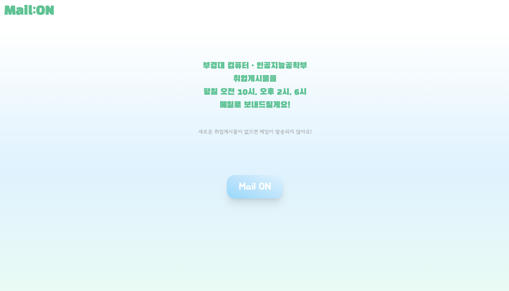

# Mail:ON 📬

부경대 컴퓨터·인공지능공학부 취업게시물을 메일로 구독하는 웹 서비스입니다.

🔗 **https://mail-on.vercel.app**

> 🚧 **개발 진행 중** — 핵심 기능은 동작하며 지속적으로 개선하고 있습니다.

<br>

## 서비스 소개

학과 게시판의 취업 관련 게시물을 직접 확인하러 들어가지 않아도,  
**평일 오전 10시, 오후 2시, 오후 6시**에 새 게시물이 있으면 메일로 보내드립니다.

<div align="center">
  
</div>

- 이메일 인증을 통해 구독 신청
- 새로운 게시물이 없으면 메일이 발송되지 않음
- 구독 즉시 최신 게시물 1건을 메일로 전송

<br>

## 기능

| 기능                 | 설명                                              |
| :------------------- | :------------------------------------------------ |
| **이메일 인증**      | 인증번호 발송 → 5분 내 인증 → 구독 등록           |
| **인증 보안**        | 인증번호 해시 저장(bcrypt), 5회 실패 시 30분 잠금 |
| **게시물 스크래핑**  | 학과 취업게시판 자동 크롤링                       |
| **스케줄 메일 발송** | 평일 10시 / 14시 / 18시 자동 발송 (node-cron)     |
| **구독 환영 메일**   | 구독 완료 시 최신 게시물과 함께 환영 메일 발송    |

<br>

## Tech Stack

### Frontend


### Backend


### Infrastructure


<br>

## 아키텍처

```
┌──────────────────┐     HTTPS      ┌──────────────────┐
│                  │   ──────────>  │                  │
│  Frontend        │                │  Backend         │
│  (React + TS)    │   <──────────  │  (Express + TS)  │
│                  │   REST API     │                  │
│  Vercel          │                │  Koyeb           │
└──────────────────┘                └────────┬─────────┘
                                             │
                                             │  Supabase Client
                                             │
                                    ┌────────▼─────────┐
                                    │                  │
                                    │  Supabase        │
                                    │  (PostgreSQL)    │
                                    │                  │
                                    └──────────────────┘
```

<br>

## 프로젝트 구조

```
Mail-On/
├── frontend/               # React + TypeScript (Vite)
│   ├── src/
│   │   ├── components/     # UI 컴포넌트 (Header, VerifyForm, NoticeAlert 등)
│   │   ├── hooks/          # 커스텀 훅 (useVerification)
│   │   ├── types/          # TypeScript 타입 정의
│   │   └── main.jsx        # 엔트리 포인트
│   └── vite.config.js
│
├── backend/                # Express + TypeScript
│   └── src/
│       ├── processors/     # 메일 발송, 게시물 처리
│       ├── repositories/   # Supabase DB 접근 계층
│       ├── schedulers/     # node-cron 스케줄러
│       ├── scrapers/       # 게시판 크롤링
│       ├── supabase/       # Supabase 클라이언트 설정
│       ├── verifications/  # 인증번호 발송·검증 로직
│       ├── types/          # TypeScript 타입 정의
│       └── app.ts          # Express 서버 엔트리 포인트
│
└── tsconfig.base.json
```

<br>

## 로컬 실행 방법

### 사전 준비

- Node.js 18+
- Supabase 프로젝트 (테이블: `subscribers`, `email_verifications`, `board_state`)
- Gmail 앱 비밀번호

### Frontend

```bash
cd frontend
npm install
# .env 파일 생성
echo "VITE_API_URL=http://localhost:3000" > .env
npm run dev
```

### Backend

```bash
cd backend
npm install
# .env 파일 생성 (아래 항목 채워넣기)
cat > .env << EOF
PORT=3000
SUPABASE_URL=your_supabase_url
SUPABASE_KEY=your_supabase_key
EMAIL=your_gmail@gmail.com
PASSWORD=your_app_password
ALLOW_CORS_URL=http://localhost:5173
EOF
npm run dev
```

<br>

## 배포 환경

| 구성 요소 | 플랫폼   | 비고                                       |
| :-------- | :------- | :----------------------------------------- |
| Frontend  | Vercel   | `main` 브랜치 push 시 자동 배포            |
| Backend   | Koyeb    | `main` 브랜치 push 시 자동 배포, 슬립 없음 |
| Database  | Supabase | PostgreSQL 기반 클라우드 DB                |

<br>

## TODO

- [ ] 구독 해지 기능
- [ ] 구독자 관리 대시보드
- [ ] 다른 학과/게시판 확장
- [ ] 모바일 반응형 UI 개선
- [ ] 테스트 코드 작성

<br>

## AI-assisted Development

이 프로젝트는 AI 도구(Claude, ChatGPT, Gemini)를 활용한 AI-assisted 방식으로 개발했습니다.  
문제 정의, 기능 설계, 프롬프트 설계, 생성 코드 검증·통합, UX 조정, 테스트, 배포, 운영은 직접 담당합니다.
